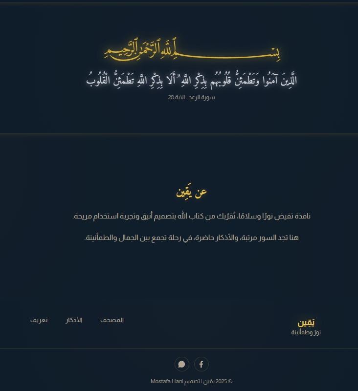
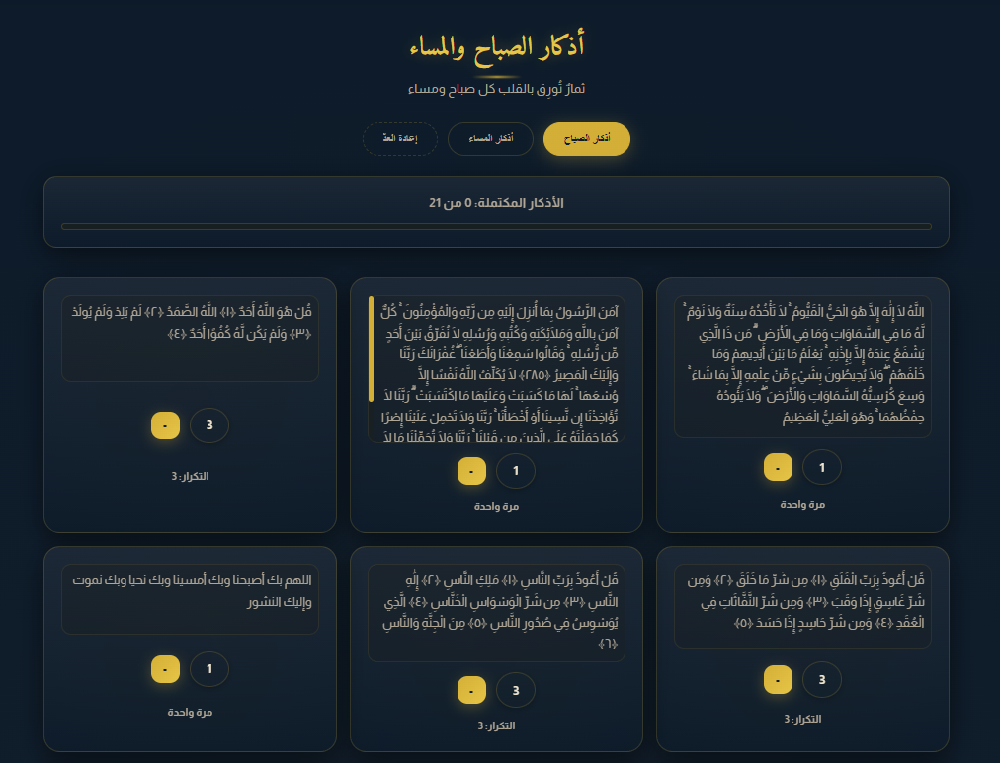
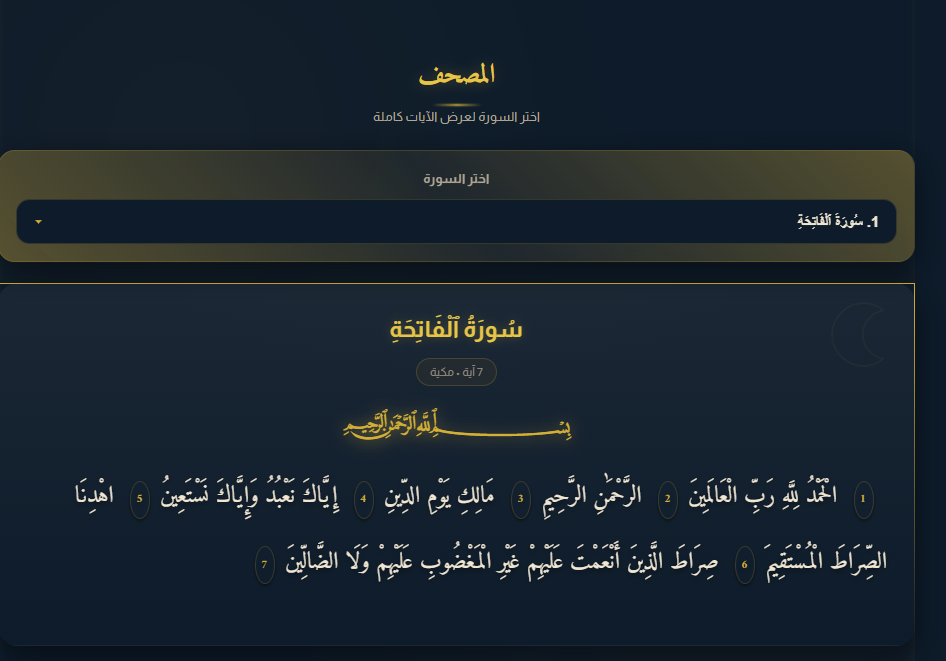

# 🌙 Yaqeen - موقع يقين الإسلامي

  

## 🕌 مقدمة
**يقين** هو موقع إسلامي حديث يجمع بين البساطة والروحانية ✨  
تم تصميمه ليكون مساحة رقمية تساعدك على تدبر القرآن وعيش تجربة إيمانية هادئة ومريحة.

الموقع يحتوي على:
- 📖 **المصحف المرتل**  
- 🌅 **أذكار الصباح والمساء**  
- 💫 **واجهة أنيقة وسهلة الاستخدام**  
- 🕋 تصميم هادئ يعبّر عن الطمأنينة والسكينة

---

## 🌟 مميزات المشروع

✅ واجهة بسيطة وسلسة  
✅ تصميم متجاوب يعمل على كل الأجهزة  
✅ نظام أذكار منسق   
✅ إمكانية تطويره لاحقًا ليشمل تلاوات متعددة وتخصيص الأذكار  
✅ مبني بطريقة قابلة للتوسّع (scalable and maintainable)

---

## 🛠️ التقنيات المستخدمة

- **HTML5**  
- **CSS3**  
- **JavaScript**  
- **Responsive Design**

---

## 🖼️ صور من الموقع

| الصفحة الرئيسية | صفحة الأذكار | المصحف والتفسير |
|-----------------|---------------|----------------|
|  |  |  |

---

